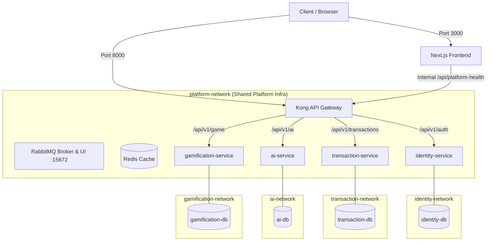

# FraudCell

> **Infrastructure Status:** ⚠️ **Skeleton & Infrastructure Baseline Completed.**  
> This monorepo currently contains the production-grade containerized microservices infrastructure, database connections, API gateway routing, message queue & cache topology, Next.js frontend, standardized contract envelopes, and automated testing framework. Business domain logic, database tables, and message handlers will be added in subsequent phases.

---

## 🎯 About FraudCell

**FraudCell** is a distributed, event-driven fraud detection platform designed for high-throughput financial transaction monitoring, real-time AI risk evaluation, identity verification, and analyst gamification.

---

## 📐 Standards & Technical Contracts

- 📄 **API Conventions Standard:** [`docs/standards/API_CONVENTIONS.md`](file:///Users/ugurberktas/Desktop/FraudCell/docs/standards/API_CONVENTIONS.md)
- 📄 **Domain Conventions Standard:** [`docs/standards/DOMAIN_CONVENTIONS.md`](file:///Users/ugurberktas/Desktop/FraudCell/docs/standards/DOMAIN_CONVENTIONS.md)
- 📄 **Security Conventions Standard:** [`docs/standards/SECURITY_CONVENTIONS.md`](file:///Users/ugurberktas/Desktop/FraudCell/docs/standards/SECURITY_CONVENTIONS.md)
- ⚡ **Domain Event Catalog & Specifications:** [`EVENTS.md`](file:///Users/ugurberktas/Desktop/FraudCell/EVENTS.md)
- 🔍 **Contract Validation Command:** `python3 scripts/validate_contracts.py`

---

## 🏛️ System Architecture



---

## 🔒 Network & Security Topology

1. **Host Isolation:** Backend microservices (`8000`) and PostgreSQL databases (`5432`) **do NOT expose host ports**. All external access is strictly routed through Kong Gateway on port `8000` or Frontend on port `3000`.
2. **Database Isolation:** Each PostgreSQL database container is attached **only** to its corresponding private service network (`identity-network`, `transaction-network`, `ai-network`, `gamification-network`). Database containers are NOT attached to `platform-network` and cannot be accessed by other microservices.
3. **Platform Network:** Kong, RabbitMQ, Redis, Frontend, and the 4 backend microservices share `platform-network` for inter-service communication.

---

## 🗄️ Service & Database Mapping

| Service | Host Route | Internal Container Port | Database Container | Database Volume | Isolated Network |
|---|---|---|---|---|---|
| **Identity Service** | `/api/v1/auth/*` | 8000 | `identity-db` | `identity-db-data` | `identity-network` |
| **Transaction Service** | `/api/v1/transactions/*` | 8000 | `transaction-db` | `transaction-db-data` | `transaction-network` |
| **AI Service** | `/api/v1/ai/*` | 8000 | `ai-db` | `ai-db-data` | `ai-network` |
| **Gamification Service** | `/api/v1/game/*` | 8000 | `gamification-db` | `gamification-db-data` | `gamification-network` |

---

## 🛠️ Technology Stack

- **Backend:** Python 3.12, FastAPI, Pydantic v2, `pydantic-settings`
- **Database Layer:** PostgreSQL 16 (Alpine), SQLAlchemy 2.x, `psycopg 3` binary
- **API Gateway:** Kong 3.7 (DB-less declarative mode)
- **Messaging & Cache:** RabbitMQ 3.13 (Management Alpine), Redis 7 (Alpine)
- **Frontend:** Next.js 14 (App Router, Standalone build), TypeScript, Vanilla CSS
- **Testing:** `pytest`, `httpx`, Custom Python Contract Validator, Smoke & Fault Isolation test suite

---

## 🚀 Getting Started

### Prerequisites

- [Docker Desktop](https://www.docker.com/products/docker-desktop/) (Engine 24+, Compose v2+)
- Python 3.12+ (for running pytest and test scripts locally)
- Node.js 22+ (for local frontend development)

### 1. Environment Setup

Copy the example environment template:

```bash
cp .env.example .env
```

> **Note:** Never commit `.env` containing production passwords to version control.

### 2. Launching the Entire Stack

Start all containers in detached mode:

```bash
docker compose up -d --build
```

### Golden Demo hazırlığı

Gerçek secret ve güçlü demo parolalarını shell environment'ında tanımladıktan sonra:

```bash
python3 scripts/demo_prepare.py
python3 scripts/demo_status.py
```

Yalnızca sabit demo operasyonel verisini güvenle temizlemek için:

```bash
python3 scripts/demo_reset.py --confirm RESET_DEMO
```

Ayrıntılı canlı sunum sırası için `docs/DEMO_RUNBOOK.md` dosyasına bakın. Scriptler
secret, parola veya token yazdırmaz; `.env` ve `demo.env` dosyaları takip edilmez.

---

## 🌐 Publicly Accessible Endpoints

| Resource | URL | Description |
|---|---|---|
| **Frontend Dashboard** | `http://localhost:3000` | Real-time platform status dashboard |
| **Frontend API Proxy** | `http://localhost:3000/api/platform-health` | Aggregated microservice health JSON |
| **Kong API Gateway** | `http://localhost:8000` | Central entry point for all API routes |
| **RabbitMQ Management** | `http://localhost:15672` | RabbitMQ Web Console (`rabbit` / `changeme_rabbit`) |

---

## 🧪 Automated Testing & Verification

### 1. Contract Validation
Validates all JSON API response examples, domain enums, and event envelopes:
```bash
python3 scripts/validate_contracts.py
```

### 2. Unit & Integration Tests (Pytest)
Run test suites across all 4 microservices:
```bash
for svc in identity-service transaction-service ai-service gamification-service; do
  cd services/$svc && .venv/bin/pytest tests/ -v && cd ../..
done
```

### 3. Automated Smoke Test
Validates frontend, gateway routes, JSON payload integrity, and port isolation:
```bash
python3 scripts/smoke_test.py
```

### 4. Automated Fault Isolation Test
Simulates `ai-service` failure, verifies gateway 502/503 isolation, ensures other services remain active, and verifies automatic recovery:
```bash
python3 scripts/fault_test.py
```

---

## 🧹 System Shutdown

Stop and remove containers (preserving database volumes):

```bash
docker compose down
```

To remove containers AND database volumes (clean reset):

```bash
docker compose down -v
```

---

## ❓ Troubleshooting & Common Issues

| Issue | Cause | Resolution |
|---|---|---|
| `Bind for 0.0.0.0:8000 failed` | Port 8000 is occupied by another process | Stop conflicting app: `lsof -i :8000` & `docker stop <container_id>` |
| `Bind for 0.0.0.0:15672 failed` | Port 15672 is occupied by existing RabbitMQ | Stop existing RabbitMQ: `docker stop <container_id>` |
| `503 Service Unavailable` on `/ready` | PostgreSQL database container is initializing | Wait a few seconds for DB healthcheck to turn `healthy` |
