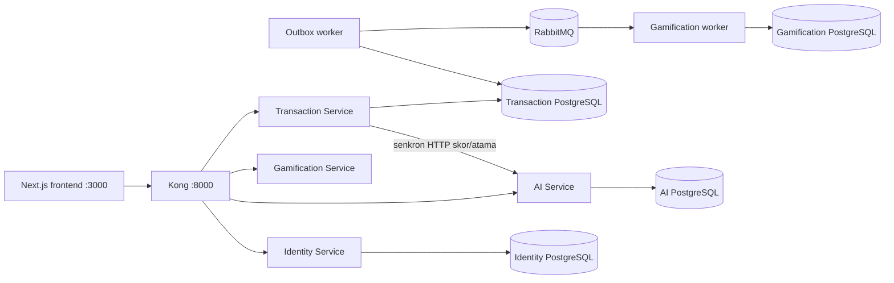

# FraudCell

FraudCell, jüri demosu için hazırlanmış dört servisli bir fraud inceleme MVP'sidir.
Customer işlemi gerçek bir scikit-learn artifacti ile skorlanır, risk vakası uygun
Analyst'e atanır, vaka kararı transactional outbox üzerinden RabbitMQ'ya yayınlanır
ve Gamification worker puan/rozet/leaderboard verisini üretir.

Bu repository bir skeleton değildir; Golden Demo iş akışı uygulanmıştır. Bununla
birlikte gerçek banka entegrasyonu, gerçek SMS, production veriyle eğitilmiş model,
TLS/secret manager, yüksek erişilebilirlik ve production gözlemlenebilirliği yoktur.
Bu nedenle sistem bir demo MVP'sidir, production-ready olduğu iddia edilmez.

## Mimari



Her servis yalnızca kendi PostgreSQL veritabanına bağlıdır. Backend ve veritabanı
portları host'a açılmaz; HTTP trafiği Kong üzerinden geçer. RabbitMQ broker portu
yalnızca Compose ağı içindedir. Frontend domain verisini API'lerden alır ve güncellemeleri
polling ile izler.

| Servis | Kong öneki | Kalıcı veri | Sorumluluk |
|---|---|---|---|
| Identity | `/api/v1/auth` | `identity-db` | OTP, staff login, JWT/refresh, RBAC, audit |
| Transaction | `/api/v1/transactions` | `transaction-db` | İşlem, vaka, state machine, outbox |
| AI | `/api/v1/ai` | `ai-db` | Model inference, Analyst profili ve atama |
| Gamification | `/api/v1/game` | `gamification-db` | Event tüketimi, ledger, rozet, leaderboard |

## Frontend route'ları

| Route | Erişim |
|---|---|
| `/` | Oturuma göre `/login`, `/customer`, `/analyst` veya `/supervisor` yönlendirmesi |
| `/login` | Customer GSM/OTP ve staff email/parola formları |
| `/customer` | Customer işlemleri, doğrulama ve feedback |
| `/analyst` | Atanmış vakalar ve Gamification profili |
| `/supervisor` | Supervisor/Admin vaka görünümü ve manuel atama |
| `/leaderboard` | Analyst, Supervisor ve Admin |

Demo modu açıkken login ekranı OTP'nin `1234` olduğunu belirtir. Çalışan Identity
konfigürasyonundaki `DEMO_OTP_CODE` da `1234` olmalıdır; gerçek SMS gönderilmez.

## Kurulum ve demo hazırlığı

Gereksinimler: Docker Desktop/Compose v2, Python 3.12+ ve frontend'i host üzerinde
çalıştırmak için Node.js 22+.

```bash
cp .env.example .env
```

Root `.env` içinde en az aşağıdaki değerleri yerel, güçlü değerlerle doldurun:

- `DEMO_ADMIN_PASSWORD`
- `DEMO_SUPERVISOR_PASSWORD`
- `DEMO_ANALYST_PASSWORD`
- `DEMO_CUSTOMER_GSM`
- `DEMO_OTP_CODE`
- `INTERNAL_SERVICE_KEY`
- `JWT_SECRET`

`.env` Git tarafından takip edilmez. Secret, parola, token veya OTP'yi terminal
çıktısına ya da dokümana kopyalamayın.

```bash
docker compose up -d --build --wait
python3 scripts/demo_reset.py --confirm RESET_DEMO
python3 scripts/demo_prepare.py
python3 scripts/demo_prepare.py
python3 scripts/demo_status.py
```

İkinci `demo_prepare.py` çağrısı idempotency kontrolüdür. Başarı halinde status
komutunun son satırı `DEMO READY` olur. Hazırlanan sabit staff hesapları:

- `demo.admin@fraudcell.com`
- `demo.supervisor@fraudcell.com`
- `demo.analyst.card@fraudcell.com`
- `demo.analyst.account@fraudcell.com`
- `demo.analyst.aml@fraudcell.com`

Parolalar yalnızca root `.env` değerlerinden gelir. Customer hesabı
`DEMO_CUSTOMER_GSM` ile hazırlanır.

## Golden Demo girdisi

Frontend'deki **Yüksek risk hızlı doldur** aşağıdaki modeli besler:

| Alan | Değer |
|---|---|
| `amount` | `48500` |
| `transaction_type` | `TRANSFER` |
| `recipient` | `Demo Alıcı` |
| `source_device` | `Yeni iPhone` |
| `city` / `home_city` | `Berlin` / `Istanbul` |
| `occurred_at` | `2026-07-23T01:30:00Z` |
| `transaction_frequency_24h` | `20` |
| `is_new_device` | `true` |

Checked-in `fraudcell-demo-v1` artifactinin bu girdideki deterministik çıktısı
`risk_score=0.840797`, `risk_level=YUKSEK`,
`fraud_type=HESAP_ELE_GECIRME`, `decision=INCELEME` ve beş gözlenen risk nedenidir.
Temiz reset sonrasında uzmanlık eşleşmesi nedeniyle Hesap Analisti atanır. Canlı API
sonucu her zaman demo sırasında ekrandan doğrulanmalıdır.

Bu `YUKSEK` senaryoda hızlı `BLOKLANDI + BEN_YAPMADIM` kararı `+30` üretir:
`CASE_RESOLVED +10`, `FAST_DECISION +5`, `CONFIRMED_FRAUD +15`. Yalnızca skor
`KRITIK` olup SLA içindeyse ek `CRITICAL_WITHIN_SLA +15` uygulanır.

## Final acceptance ve testler

Çalışan ve temiz hazırlanmış platformda:

```bash
python3 scripts/final_acceptance.py
```

Script gerçek API/OpenAPI operasyonlarını, PostgreSQL kayıtlarını, iki workerı,
RabbitMQ akışını, puan/rozet/leaderboard sonucunu ve AI stop/fallback/recovery
davranışını kontrol eder.
Tam başarıda exit code `0` ve son satır `FRAUDCELL FINAL ACCEPTANCE PASSED` olur.

Servis testleri ve frontend kontrolleri:

```bash
cd services/identity-service && .venv/bin/pytest tests -q
cd ../transaction-service && .venv/bin/pytest tests -q
cd ../ai-service && .venv/bin/pytest tests -q
cd ../gamification-service && .venv/bin/pytest tests -q
cd ../../frontend && npm run lint && npm test && npm run build
```

Repository kökünden kalan kontroller:

```bash
python3 scripts/validate_contracts.py
docker compose config
python3 scripts/smoke_test.py
python3 scripts/fault_test.py
git diff --check
```

## Dokümantasyon

- [API kuralları](docs/standards/API_CONVENTIONS.md)
- [Domain kuralları](docs/standards/DOMAIN_CONVENTIONS.md)
- [Güvenlik kuralları](docs/standards/SECURITY_CONVENTIONS.md)
- [Uygulanan event akışı](EVENTS.md)
- [AI yaklaşımı](docs/AI_APPROACH.md)
- [Operasyon runbook'u](docs/DEMO_RUNBOOK.md)
- [6–7 dakikalık sunum metni](docs/FINAL_DEMO_SCRIPT.md)
- [Jüri soru-cevap notları](docs/JURY_QA.md)

## Kapatma

Veritabanı volume'larını koruyarak:

```bash
docker compose down
```

`docker compose down -v` tüm Compose volume'larını siler; yalnızca bilinçli temiz
kurulum gerektiğinde kullanılmalıdır.
